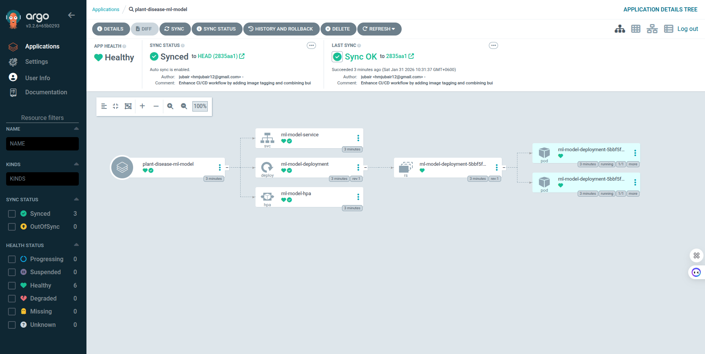

# Plant Disease Detection

ML model deployment with GitHub Actions CI/CD.

## Pipeline (CI/CD)

- **Build & push Docker image** – On push to `main`, tags the image with git short SHA, logs in to Docker Hub, and pushes the image.
- **Update manifest** – Updates `k8s-manifests/deployment.yaml` with the new image tag and commits/pushes so ArgoCD can sync.

## Kubernetes manifests

Manifests live in `k8s-manifests/`: deployment (app + image tag from pipeline), service (NodePort on 8501), and HPA (Horizontal Pod Autoscaler).

## Secrets

Store Docker Hub credentials in repo Settings → Secrets and variables → Actions.

## ArgoCD Dashboard

